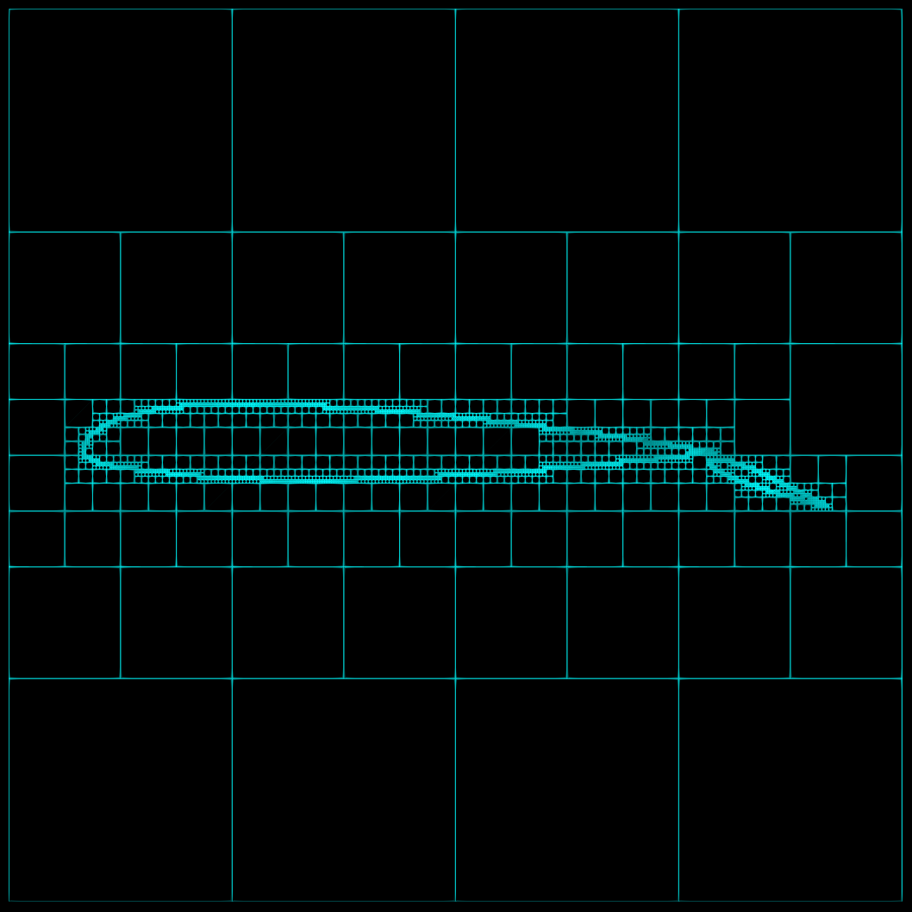

# Quadtree 

## Description
This project implements a quadtree data structure for meshing a given 2D geometry. The 2D geometry is taken from a GMSH (.msh) file, which defines the vertices and connectivity of line segments outlining the boundary. The code adapts to the geometry and refines the quadtree to accurately capture the geometry.



## Installation
To set up the project, follow these steps:

1. Clone the repository:
   ```bash
   git clone https://github.com/Mjaiswal117/QuadTree.git
   ```
2. Navigate and Build:
   ```
   cd QuadTree
   mkdir build
   cd build
   cmake ..
   make
   cd ../
   ```
## Usage
To run an example, navigate to the example directory and run the following command:
```
cd example/
../build/mesh_quadtree wing.msh 2 9 wing.vtk
```
This will generate a mesh from the wing.msh file with base subdivisions of 2 and refinement subdivisions of 9, and output the mesh to the wing.vtk file.

### Arguments
`../build/mesh_quadtree <msh_filename> <base_subdivisions> <refine_subdivisions> <output_filename>`
* msh_filename - Input GMSH file defining the geometry.
* base_subdivisions - Number of base subdivisions for the quadtree.
* refine_subdivisions - Number of refinement subdivisions for the quadtree.
* output_filename - Output file name for the generated mesh in VTK format.
